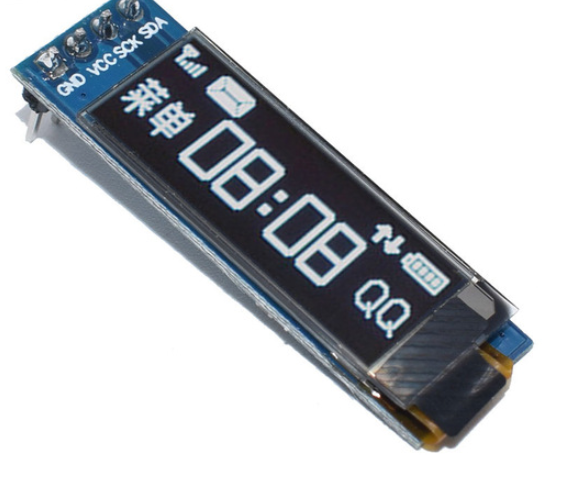

# ATTiny85 interfacing with OLED 128x32
This repository can be used to interface the tiny 128x32 OLED with the ATTiny85 microcontroller using the Tiny4kLED library

## OLED 128x32 Buying links

You may source the OLED from your local stores. I bought it from Aliexpress. Was cheaper and delivered without any issues.  
https://www.aliexpress.com/item/32672229793.html?spm=a2g0s.9042311.0.0.6a484c4dSF0KXa

## Application

I setup a cool Christmas Electronic badge using this OLED.  
Link: https://github.com/jithinsisaac/KiCad-Electronic-Badge